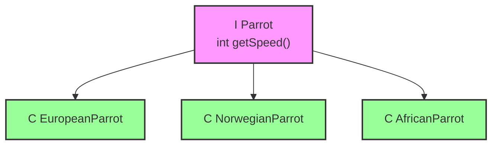

# Klausur Programmierpraktikum 1, SS 2022 (22. Juli 2022)

### Aufgabe 1 [10 Punkte]

Für diese Aufgabe wollen wir uns ein System vorstellen, das Lebensmittel inventarisiert. Ein Lebensmittel hat eine Bezeichnung und ein Mindesthaltbarkeitsdatum (MHD). Die Lebensmittel-Klasse ist als folgender Record implementiert:

```java
public record Produkt(String bezeichnung, LocalDate mhd)
    implements Comparable<Produkt> {
    public boolean mhdUeberschritten() { return LocalDate.now().isAfter(mhd); }
    public int compareTo(Produkt other) { return mhd.compareTo(other.mhd); }
    // Getter bezeichnung() und mhd() sind automatisch vorhanden
}
```

Die Verwaltung wird in einer Klasse umgesetzt, in der bereits eine Methode vorhanden ist, die uns die Menge aller vorhandenen Produkte zurückgibt. Die Signatur dieser Methode ist `Set<Produkt> alleProdukte()`.

**(a) [6 Punkte]** Das System soll die (höchstens) n Lebensmittel heraussuchen können, deren Mindesthaltbarkeitsdatum als Nächstes abläuft. Produkte, deren MHD bereits überschritten ist, sollen **nicht** in die Liste übernommen werden. (D. h. es werden die als nächstes ablaufenden, aber noch nicht abgelaufenen Lebensmittel zurückgegeben.) **Verwenden Sie ausschließlich Streams. Für nicht-idiomatische Lösungen oder Lösungen, die keinen Stream verwenden, gibt es keine Teilpunkte.**

```java
public List<Produkt> verfallenBald(int n) {

}
```

**Lösung:**
```java
return alleProdukte().stream()
    .filter(p -> !p.mhdUeberschritten())
    .sorted()
    .limit(n)
    .toList();
```

**(b) [4 Punkte]** Wir wollen eine Liste ausgeben, die die (höchstens) n Lebensmittel auf der Konsole ausgibt, deren MHD als Nächstes abläuft. Es soll die Position in der Liste und die Bezeichnung des Produkts ausgegeben werden.
Die Ausgabe für n = 3 soll z. B. folgendermaßen aussehen:
1. Quark
2. Milch
3. Brot

**Schreiben Sie idiomatischen Java-Code, der die Liste ausgibt. Für nicht-idiomatischen Code gibt es keine Teilpunkte.** Verwenden Sie die Methode aus (a), auch wenn Sie diese nicht implementiert haben.

```java
public void printVerfallenBald(int n) {

}
```

**Lösung:**
```java
List<Produkt> verfallenBald = verfallenBald(n);
for (int i = 0; i < verfallenBald.size(); i++) {
    System.out.printf("%d: %s%n", i + 1, verfallenBald.get(i).bezeichnung());
}
```

### Aufgabe 2 [8 Punkte]

Angenommen, wir haben eine Anwendung im Banking-Bereich, bei der wir Verzinsung berechnen wollen. Dazu existiert folgender Code zur Berechung eines einfachen, linearen Zins.

```java
public class Festgeld {
    private long guthaben;
    private final double zinssatz;
    private final LocalDate anlageDatum;

    public Festgeld(double zinssatz, int anlageJahr) {
        this.zinssatz = zinssatz;
        this.anlageDatum = LocalDate.of(anlageJahr, 1, 1);
    }

    public void einzahlen(long betrag) {
        this.guthaben += betrag;
    }

    public long guthabenAm(LocalDate datum) {
        long jahre = ChronoUnit.YEARS.between(anlageDatum, datum);
        return (long) (guthaben * (1 + zinssatz * jahre));
    }
}
```

**(a) [6 Punkte]** Schreiben Sie eine Test-Methode, die prüft, dass ein Festgeld mit einem Startguthaben von 2000 und einem Zinssatz von 0,01 nach 3 Jahren ein Guthaben von 2060 hat. Machen Sie in Ihrem Code deutlich, welche Statements jeweils zu Act, Arrange bzw. Assert gehören.

**Lösung:**
```java
@Test
@DisplayName("Zinsberechnung mit einer Laufzeit größer als 0")
void test_1() {
    LinearZins zins = new LinearZins(0.01, 2022); // Arrange
    zins.einzahlen(2000);
    long saldo = zins.guthabenAm(LocalDate.of(2025, 2, 2)); // Act
    assertThat(saldo).isEqualTo(2060); // Assert
}
```

**(b) [2 Punkte]** Ist die Methode `guthabenAm` seiteneffektfrei (also pure)? Wenn ja: Woran erkennen Sie das? Wenn nein, wie könnten wir die Methode umschreiben, sodass sie pure ist? (Es soll kein Code geschrieben werden, eine Beschreibung reicht.)

**Lösung:**
Die Methode ist pure, Es gibt keinen veränderlichen Zustand und die Rückgabe ist vollständig durch die Eingaben bestimmt.
Durch eine kurzfristige Änderung der Aufgabe ist die Methode tatsächlich seiteneffektfrei, aber nicht pure, da sie von veränderlichem Zustand (guthaben) abhängt. Ein Verweis darauf wurde bei der Korrektur auch als korrekt gewertet.

### Aufgabe 3 [8 Punkte]

Werfen wir nochmal einen Blick auf unser Parrot Kata. Wir haben dort die Klassenstruktur angepasst, um die Wartbarkeit zu verbessern. Ursprünglich hatten wir eine Klasse, in der die Geschwindigkeit eines Papageis mithilfe eines switch-case-Statements berechnet wurde. Wir haben daraus in etwa folgende Struktur erzeugt:



**(a) [2 Punkte]** Welches Prinzip war im ursprünglichen Code verletzt und hat uns dazu gebracht, die Strukturänderung vorzunehmen? Es reicht, wenn Sie das Prinzip nennen.

**Lösung:**
Open Close Prinzip

**(b) [4 Punkte]** Welcher Code-Smell liegt **nach** der Änderung vor? Nennen Sie den Namen des Smells und beschreiben Sie ihn in 1-2 Sätzen.

**Lösung:**
Shotgun Surgery: Änderungen müssen an vielen Stellen gemacht werden

**(c) [2 Punkte]** Was müsste mit dem Code in der Zukunft passieren, damit sich der neu eingeführte Code Smell negativ auf die Wartbarkeit auswirkt?

**Lösung:**
Wenn eine neue Methode in Parrot eingeführt wird, dann müssen wir alle Subklassen anfassen.

### Aufgabe 4 [4 Punkte]

Wir wollen eine Anwendung zur Warnung vor Schlechtwetter-Ereignissen mit Spring Boot schreiben. Dazu wollen wir eine externe Komponente einbinden, die Radarbilder verwendet, um Tornardos vorherzusagen. Die Komponente ist in der Klasse `TornardoWarnung` implementiert und hat einen Konstruktor, der ein Objekt vom Typ `BildQuelle` übergeben bekommt. Für das Interface `BildQuelle` haben wir schon eine Spring Bean geschrieben. Allerdings können wir die Klasse `TornaradoWarnung` nicht ändern, weil sie in anderen (nicht-Spring) Projekten verwendet wird.

**(a) [3 Punkte]** Schreiben Sie den Code, der notwendig ist, um `TornardoWarnung` als Spring Bean zu injizieren.

**Lösung:**
```java
@Bean
TornardoWarnung initWarnung(BildQuelle quelle) {
    return new TornaradoWarnung(quelle);
}
```

**(b) [1 Punkt]** In welcher Klasse sollte der Code, den Sie gerade geschrieben haben, untergebracht werden? Sie brauchen keine konkrete Klasse zu benennen, sondern nur, welche Eigenschaft die Klasse haben muss.

**Lösung:**
Muss mit `@Configuration` (oder einer abgeleiteten Variante, wie `@SpringBootApplication`) annotiert sein.

### Aufgabe 5 [10 Punkte]

Wir wollen eine Rechtschreibkorrektur in eine Anwendung einbauen. Folgender Code ist bereits fertig:

```java
public interface Woerterbuch {
    boolean enthaelt(String wort);
    int size();
}

public class Checker {
    private final Woerterbuch woerterbuch;

    public Checker(Buchsammlung sammlung) {
        this.woerterbuch = sammlung.get("WildesWortWerk");
    }

    public boolean satzKorrekt(String satz) {
        return Arrays.stream(satz.split(" "))
            .allMatch(woerterbuch::enthaelt);
    }
}
```

**(a) [6 Punkte]** Schreiben Sie einen Testfall für `satzkorrekt`, bei dem alle Wörter eines nicht leeren Testsatzes in dem Testwörterbuch vorhanden sind. Der Inhalt des Wörterbuchs `WildesWortWerk` ist uns vollkommen unbekannt.

**Lösung:**
```java
@Test
void test1() {
    Buchsammlung bs = mock(Buchsammlung.class);
    Woerterbuch wb = mock(Woerterbuch.class);
    when(wb.enthaelt(any())).thenReturn(true);
    when(bs.get(any())).thenReturn(wb);
    Checker c = new Checker(bs);
    assertThat(c.satzKorrekt("foo")).isTrue();
}
```

**(b) [4 Punkte]** Der Code ist zwar testbar, aber er ist im Hinblick auf die Testbarkeit noch nicht ganz optimal.
*   Der Code verletzt eine der Regeln, die wir für die Strukturierung von Code kennengelernt haben. Um welche handelt es sich?
*   Begründen Sie, warum eine Verletzung vorliegt. Geben Sie dazu auch die genaue Stelle im Code an.
*   Wie kann das Problem behoben werden?
*   Warum ist die Verletzung potenziell ein Problem für die Wartbarkeit?

**Lösung:**
LoD-Verletzung (don't talk with strangers) Methode `enthaelt` wird auf Rückgabewert von `get` aufgerufen, was Methode im Parameter `sammlung` ist. `Woerterbuch` statt `Buchsammlung` an den Konstruktor übergeben Checker muss sowohl Buchsammlung, als auch Woerterbuch kennen, sodass sich Änderungen an beiden Klassen auch auf Checker (und die Tests) auswirken.

### Aufgabe 6 [2 Punkte]

Angenommen, wir haben ein Git-Repository, das in folgendem Zustand ist:

```
0---1---2---3
           \
            - main
             \
              4----5*
                 - dev
```

Das `*` kennzeichnet den Commit/Branch, der gerade ausgecheckt ist. Das Kommando `git status` gibt folgendes aus:

```
On branch dev
nothing to commit, working tree clean
```

Gehen Sie in dieser Aufgabe davon aus, dass alle Commits jeweils unterschiedliche Dateien betreffen.

**(a) [1 Punkt]** Mit welchem Git-Befehl können wir das Repository in folgenden Zustand bringen? Die Commits 4' und 5' sind inhaltlich zu 4 bzw. 5 identisch, haben aber andere Hashcodes.

```
0---1---2---3----4'---5'*
           - main    - dev
           /
      4----5
```

**Lösung:**
`git rebase main`

**(b) [1 Punkt]** Mit welchem Git-Befehl können wir das ursprüngliche Repository in folgenden Zustand bringen?

```
0---1---2---3-------
           \       /
            - main
             \     /
              4---5---6*
                     - dev
```

**Lösung:**
`git merge main`
